<div align="center">

# 📚 PageIndex Enterprise Knowledge Portal

### Reasoning-Based RAG for Internal Document Intelligence

[](https://www.python.org/downloads/)
[](https://streamlit.io)
[](https://github.com/VectifyAI/PageIndex)
[](https://ollama.com)
[](https://www.trychroma.com/)
[](LICENSE)
[](Dockerfile)
[](#12-testing)

<br/>

> **Ship an enterprise-grade knowledge portal in minutes.**  
> Upload internal documents → PageIndex builds a reasoning tree → Employees ask natural-language questions → Ollama generates grounded, cited answers — all running 100 % on-premises.

<br/>

```
┌──────────────┐    ┌───────────────┐    ┌─────────────────┐    ┌────────────┐
│  Employee    │───▶│  Streamlit    │───▶│  PageIndex      │───▶│  Ollama    │
│  (Browser)   │    │  Portal       │    │  + ChromaDB     │    │  LLM       │
│              │◀───│              │◀───│                 │◀───│  (Local)   │
└──────────────┘    └───────────────┘    └─────────────────┘    └────────────┘
```

</div>

---

## Table of Contents

| # | Section | Description |
|---|---------|-------------|
| 1 | [Overview](#1-overview) | Problem, solution, and key capabilities |
| 2 | [Architecture](#2-architecture) | System design and data flow |
| 3 | [Features at a Glance](#3-features-at-a-glance) | Complete feature inventory |
| 4 | [Prerequisites](#4-prerequisites) | What you need before starting |
| 5 | [Quick Start](#5-quick-start) | Get running in under 5 minutes |
| 6 | [UI Walkthrough & Snapshots](#6-ui-walkthrough--snapshots) | Visual preview of every screen and component |
| 7 | [Step-by-Step Execution Guide](#7-step-by-step-execution-guide) | Detailed terminal + UI walkthrough |
| 8 | [Project Structure](#8-project-structure) | File-by-file walkthrough |
| 9 | [Configuration](#9-configuration) | Every knob you can turn |
| 10 | [Usage Guide](#10-usage-guide) | Step-by-step workflows |
| 11 | [API Reference](#11-api-reference) | Key classes and methods |
| 12 | [Docker Deployment](#12-docker-deployment) | Container-based production setup |
| 13 | [Testing](#13-testing) | How to run and extend the test suite |
| 14 | [Troubleshooting](#14-troubleshooting) | Common issues and fixes |
| 15 | [Production Checklist](#15-production-checklist) | Enterprise hardening guide |
| 16 | [Contributing](#16-contributing) | How to help improve this project |
| 17 | [License](#17-license) | MIT |

---

## 1. Overview

### The Problem

Enterprise teams drown in internal documentation — HR policies, compliance manuals, SOPs, training guides, technical runbooks. Finding the right answer means hunting through dozens of files. Traditional keyword search fails because employees ask *questions*, not *keywords*.

### The Solution

This portal combines two retrieval paradigms for maximum accuracy:

| Layer | Technology | How It Works |
|-------|-----------|--------------|
| **Primary** | [PageIndex](https://github.com/VectifyAI/PageIndex) | Builds a hierarchical "table-of-contents" tree from each document. At query time, an LLM reasons over the tree to locate the most relevant sections — no vector similarity, no chunking artefacts. |
| **Secondary** | [ChromaDB](https://www.trychroma.com/) | Classic dense-vector retrieval over overlapping text chunks. Provides fast semantic search and acts as a fallback when PageIndex tree search is unavailable. |

The LLM layer ([Ollama](https://ollama.com)) runs entirely on-premises — **zero data leaves your network**.

### Key Capabilities

- **Multi-format ingestion** — PDF, DOCX, TXT, Markdown
- **Dual retrieval** — Reasoning-based tree search + embedding-based vector search
- **Conversational Q&A** — Multi-turn chat grounded in your documents
- **Source citation** — Every answer links back to the originating file, section, and chunk with relevance scoring
- **Analytics dashboard** — Document insights, chunk distribution, query session logs
- **Document explorer** — Browse indexed documents with chunk-level content inspection
- **Dual export** — Save answers as Markdown reports or professional PDFs
- **Smart suggestions** — Auto-generated questions based on indexed document names
- **Query history** — Track all queries with response times and source counts
- **100 % local** — No cloud APIs, no data exfiltration

---

## 2. Architecture

```
┌─────────────────────────────────────────────────────────────────────────┐
│                        Streamlit UI (app.py)                            │
│  ┌─────────────┐  ┌─────────┐  ┌────────┐  ┌────────┐  ┌───────────┐  │
│  │ Sidebar      │  │ Search  │  │ Chat   │  │Analyti-│  │ Document  │  │
│  │ • Upload     │  │ Tab     │  │ Tab    │  │ cs Tab │  │ Explorer  │  │
│  │ • Status     │  │         │  │        │  │        │  │ Tab       │  │
│  │ • Documents  │  │         │  │        │  │        │  │           │  │
│  │ • History    │  │         │  │        │  │        │  │           │  │
│  └──────┬──────┘  └────┬────┘  └───┬────┘  └───┬────┘  └─────┬─────┘  │
│         │              │           │            │             │         │
└─────────┼──────────────┼───────────┼────────────┼─────────────┼─────────┘
          │              │           │            │             │
          ▼              ▼           ▼            ▼             ▼
┌─────────────────────────────────────────────────────────────────────────┐
│              Indexing Pipeline (indexing_pipeline.py)                    │
│                                                                         │
│  ┌──────────────────┐    ┌──────────────────────────────────────┐       │
│  │ PageIndex Client  │    │ ChromaDB VectorStore                 │       │
│  │ • Tree indexing   │    │ • Chunk + embed + store              │       │
│  │ • Structure query │    │ • Cosine similarity search           │       │
│  │ • Doc navigation  │    │ • Chunk-level retrieval              │       │
│  └────────┬─────────┘    └───────────────┬──────────────────────┘       │
│           │                              │                              │
└───────────┼──────────────────────────────┼──────────────────────────────┘
            │                              │
            ▼                              ▼
┌──────────────────────┐    ┌──────────────────────────────────────┐
│ PageIndex Workspace   │    │ Ollama Server (ollama_client.py)     │
│ (data/workspace/)     │    │ • Chat completion (streaming)        │
│ Tree JSON structures  │    │ • Embedding generation               │
└──────────────────────┘    │ • RAG answer synthesis               │
                            └──────────────────────────────────────┘
```

### Data Flow

```
Upload  →  Deduplicate (SHA-256)  →  Parse (PDF/DOCX/TXT/MD)
   ↓
Tree Index (PageIndex)  +  Chunk & Embed (ChromaDB)
   ↓
Registry (doc_registry.json)  →  Ready for queries
   ↓
Query  →  Dual Retrieval  →  LLM Synthesis  →  Cited Answer
   ↓
Export (Markdown / PDF)  +  Track (Query History)
```

---

## 3. Features at a Glance

| Category | Feature | Description |
|----------|---------|-------------|
| **Ingestion** | Multi-format upload | PDF, DOCX, TXT, Markdown via drag-and-drop |
| **Ingestion** | Duplicate detection | SHA-256 content hashing prevents re-indexing |
| **Ingestion** | Progress tracking | Real-time progress bar + toast notifications |
| **Retrieval** | PageIndex tree search | Reasoning-based hierarchical document navigation |
| **Retrieval** | ChromaDB vector search | Dense embedding cosine similarity retrieval |
| **Retrieval** | Configurable results | Adjust number of retrieved sources (1-10) |
| **Search** | Smart suggestions | Auto-generated questions from document names |
| **Search** | Relevance bars | Visual relevance scoring with gradient progress bars |
| **Search** | Source citations | File name, chunk index, and percentage match score |
| **Chat** | Multi-turn RAG | Conversational Q&A with document-grounded responses |
| **Chat** | Source expandability | Expandable source references in each message |
| **Chat** | Clear conversation | Reset chat history with one click |
| **Analytics** | File type distribution | Donut chart showing document type breakdown |
| **Analytics** | Chunks per document | Bar chart comparing document chunk counts |
| **Analytics** | Document sizes | Horizontal bar chart of document file sizes |
| **Analytics** | Query session log | Tabular log of all queries with timing and source counts |
| **Documents** | Document explorer | Browse all indexed documents with metadata |
| **Documents** | Chunk viewer | Inspect individual chunks within each document |
| **Documents** | Filter & search | Text filter to quickly find documents |
| **Documents** | Bulk operations | Delete individual or all documents |
| **Export** | Markdown export | Save Q&A to timestamped `.md` files |
| **Export** | PDF export | Professional PDF reports with headers and source listing |
| **System** | Health monitoring | Real-time Ollama status, model listing, storage metrics |
| **System** | Query history | Sidebar panel tracking recent queries with timestamps |
| **System** | 6-metric dashboard | Documents, chunks, LLM status, model, storage, query count |

---

## 4. Prerequisites

| Dependency | Version | Purpose |
|-----------|---------|---------|
| **Python** | 3.11+ | Runtime |
| **Ollama** | latest | Local LLM server |
| **Git** | any | Clone the repo |
| **pip** | 23+ | Package installer (ships with Python) |
| **Docker** *(optional)* | 24+ | Container deployment |

### 4.1 Install Python

<details>
<summary><strong>🍎 macOS</strong></summary>

**Option A — Homebrew (recommended)**
```bash
brew install python@3.12
python3 --version   # Python 3.12.x
```

**Option B — Official installer**

Download from [python.org/downloads/macos](https://www.python.org/downloads/macos/) and run the `.pkg` installer.

**Option C — pyenv (manage multiple versions)**
```bash
brew install pyenv
pyenv install 3.12
pyenv global 3.12
python --version
```

</details>

<details>
<summary><strong>🪟 Windows</strong></summary>

**Option A — Official installer (recommended)**

1. Download from [python.org/downloads/windows](https://www.python.org/downloads/windows/)
2. Run the installer — **check "Add python.exe to PATH"** before clicking Install
3. Verify in PowerShell:
```powershell
python --version   # Python 3.12.x
pip --version
```

**Option B — Microsoft Store**

Open the Microsoft Store, search for **Python 3.12**, and click Install.

**Option C — winget**
```powershell
winget install Python.Python.3.12
```

**Option D — Chocolatey**
```powershell
choco install python --version=3.12
```

> **Note:** On Windows, use `python` instead of `python3` in all commands below.

</details>

### 4.2 Install Git

<details>
<summary><strong>🍎 macOS</strong></summary>

```bash
# Ships with Xcode Command Line Tools
xcode-select --install

# Or via Homebrew
brew install git
```

</details>

<details>
<summary><strong>🪟 Windows</strong></summary>

**Option A — Official installer**

Download from [git-scm.com/download/win](https://git-scm.com/download/win) and run the installer (default options are fine).

**Option B — winget**
```powershell
winget install Git.Git
```

Verify:
```powershell
git --version
```

</details>

### 4.3 Install Ollama

<details>
<summary><strong>🍎 macOS</strong></summary>

**Option A — Install script**
```bash
curl -fsSL https://ollama.com/install.sh | sh
```

**Option B — Homebrew**
```bash
brew install ollama
```

**Option C — Direct download**

Download the macOS app from [ollama.com/download](https://ollama.com/download) and drag it to Applications.

</details>

<details>
<summary><strong>🪟 Windows</strong></summary>

1. Download the Windows installer from [ollama.com/download](https://ollama.com/download)
2. Run `OllamaSetup.exe` and follow the prompts
3. Verify in PowerShell:
```powershell
ollama --version
```

</details>

### 4.4 Pull Required Models

```bash
# LLM for Q&A and indexing
ollama pull llama3

# Embedding model for vector search
ollama pull nomic-embed-text
```

> **Tip:** You can substitute any Ollama model (`mistral`, `gemma`, `phi3`, `qwen2`) — just update `config.yaml`.

---

## 5. Quick Start

### Option A — Local Install (Recommended for Development)

<details>
<summary><strong>🍎 macOS / Linux</strong></summary>

```bash
# 1. Clone the repository
git clone https://github.com/maneeshkumar52/pageindex-enterprise-wiki.git pageindex-wiki
cd pageindex-wiki

# 2. Create and activate virtual environment
python3 -m venv .venv
source .venv/bin/activate

# 3. Upgrade pip and install dependencies
pip install --upgrade pip
pip install -r requirements.txt

# 4. Start Ollama (in a separate terminal)
ollama serve

# 5. Launch the portal
streamlit run app.py
```

</details>

<details>
<summary><strong>🪟 Windows (PowerShell)</strong></summary>

```powershell
# 1. Clone the repository
git clone https://github.com/maneeshkumar52/pageindex-enterprise-wiki.git pageindex-wiki
cd pageindex-wiki

# 2. Create and activate virtual environment
python -m venv .venv
.venv\Scripts\Activate.ps1

# 3. Upgrade pip and install dependencies
python -m pip install --upgrade pip
pip install -r requirements.txt

# 4. Start Ollama (in a separate terminal)
ollama serve

# 5. Launch the portal
streamlit run app.py
```

> **PowerShell Execution Policy:** If `.venv\Scripts\Activate.ps1` is blocked, run:
> ```powershell
> Set-ExecutionPolicy -ExecutionPolicy RemoteSigned -Scope CurrentUser
> ```

</details>

<details>
<summary><strong>🪟 Windows (Command Prompt)</strong></summary>

```cmd
:: 1. Clone the repository
git clone https://github.com/maneeshkumar52/pageindex-enterprise-wiki.git pageindex-wiki
cd pageindex-wiki

:: 2. Create and activate virtual environment
python -m venv .venv
.venv\Scripts\activate.bat

:: 3. Upgrade pip and install dependencies
python -m pip install --upgrade pip
pip install -r requirements.txt

:: 4. Start Ollama (in a separate terminal)
ollama serve

:: 5. Launch the portal
streamlit run app.py
```

</details>

Open **http://localhost:8501** in your browser. Done.

### Option B — Docker Compose (Recommended for Production)

```bash
# Brings up Ollama + Wiki app
docker compose up -d

# Pull models inside the container
docker exec -it ollama ollama pull llama3
docker exec -it ollama ollama pull nomic-embed-text

# Open http://localhost:8501
```

### Option C — pip Install (Without Cloning)

If you only want to try the dependencies without cloning:

```bash
pip install streamlit chromadb pageindex litellm PyMuPDF python-docx fpdf2 PyYAML requests altair pandas python-dotenv
```

Then clone and run as shown in Option A.

---

## 6. UI Walkthrough & Snapshots

> Real screenshots from the live application. Each section walks you through a component, explains its purpose, and shows exactly what you will see in the browser.

### 6.1 Landing Page — Header, Metrics Ribbon & Tab Navigation

The landing page is the first thing users see when they open the portal. It features a **gradient purple hero header** with the project tagline and technology badges, a **six-metric ribbon** showing live system stats (Documents, Chunks, LLM status, active Model, Storage, and Queries), and **five navigation tabs** for the core features.


**What you see here:**
- **Hero header** — gradient purple banner with the app title, description, and tech badges (PageIndex RAG, Ollama LLM, ChromaDB Vectors, 100% Local, Multi-Format).
- **Metrics ribbon** — six KPI cards that update in real time: document count, chunk count, LLM connection status, active model name, total storage, and query count.
- **Tab bar** — Search, Chat, Analytics, Documents, and About tabs. Each tab opens a distinct functional area.

---

### 6.2 Sidebar — Upload, Documents & System Status

The sidebar is the control panel. It is always visible on the left side of the screen. From here, users upload documents, see indexed files, check system health, and review recent queries.

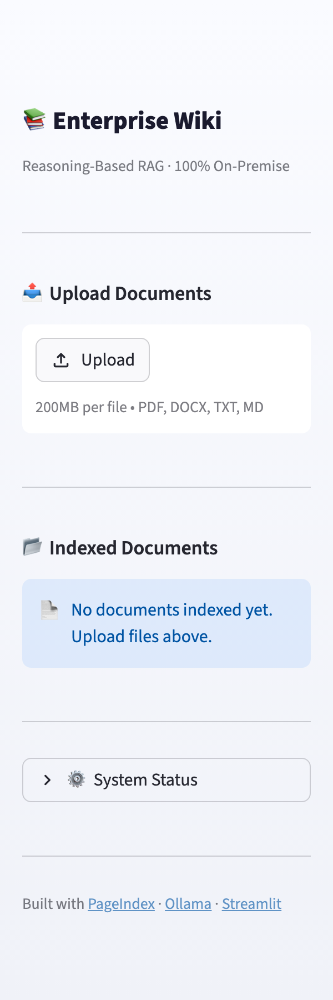

**Key components:**
- **Upload Documents** — drag-and-drop file uploader accepting PDF, DOCX, TXT, and Markdown files with an "Index All Files" button.
- **Indexed Documents** — each indexed file shows its type badge (TXT/MD/PDF/DOCX), chunk count, file size, and indexing timestamp. Each entry has a "Remove" button for deletion.
- **System Status** — collapsible panel showing Ollama connection (Online/Offline), available models, document and chunk counts, and total storage.
- **Clear All Documents** — bulk delete button to reset the entire knowledge base.

---

### 6.3 Empty State — Search Tab (Before Indexing)

When no documents have been indexed, the Search tab shows an empty state prompting users to upload content. This guides new users through the onboarding flow.


---

### 6.4 Empty State — Chat Tab (Before Indexing)

Similarly, the Chat tab displays an empty state before any documents are indexed, letting users know they need to upload files first.

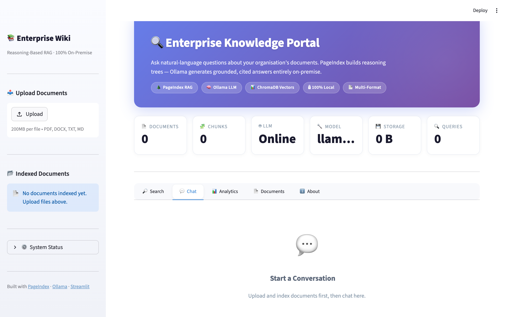

---

### 6.5 Empty State — Analytics Tab (Before Indexing)

The Analytics tab shows placeholder content when no data is available, ensuring users understand the dashboard will populate after indexing.

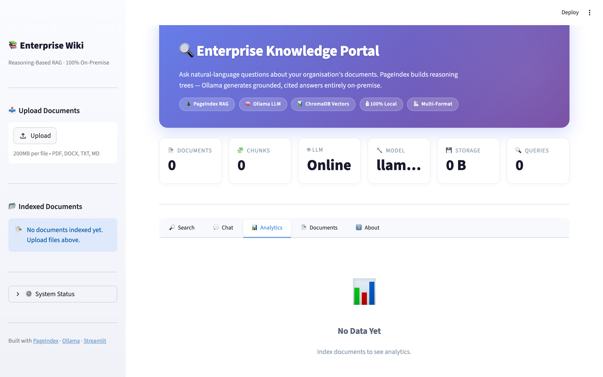

---

### 6.6 Empty State — Documents Tab (Before Indexing)

The Documents tab displays an empty explorer view, ready to list files once they are indexed.


---

### 6.7 About Tab — How It Works, Architecture & Tech Stack

The About tab is a built-in documentation page that explains the system architecture visually. It includes:

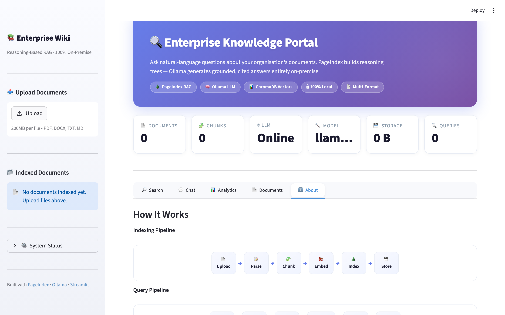

**What you will find:**
- **Indexing Pipeline** — a visual flow showing Upload, Parse, Chunk, Embed, Index, Store.
- **Query Pipeline** — a visual flow showing Query, Search, Rank, Generate, Answer, Cite.
- **Dual Retrieval Architecture** — table comparing PageIndex (reasoning tree) vs ChromaDB (vector search).
- **System architecture diagram** — Browser, Streamlit, PageIndex + ChromaDB, Ollama.
- **Tech Stack cards** — PageIndex, Ollama, ChromaDB, and Streamlit with descriptions.
- **Live configuration** — current settings (LLM model, embedding model, chunk size, overlap, temperature, max upload size).

---

### 6.8 Step 1: Upload Files

To index documents, use the sidebar file uploader. Select one or more files (PDF, DOCX, TXT, MD). The screenshot below shows three sample documents selected and ready for indexing.

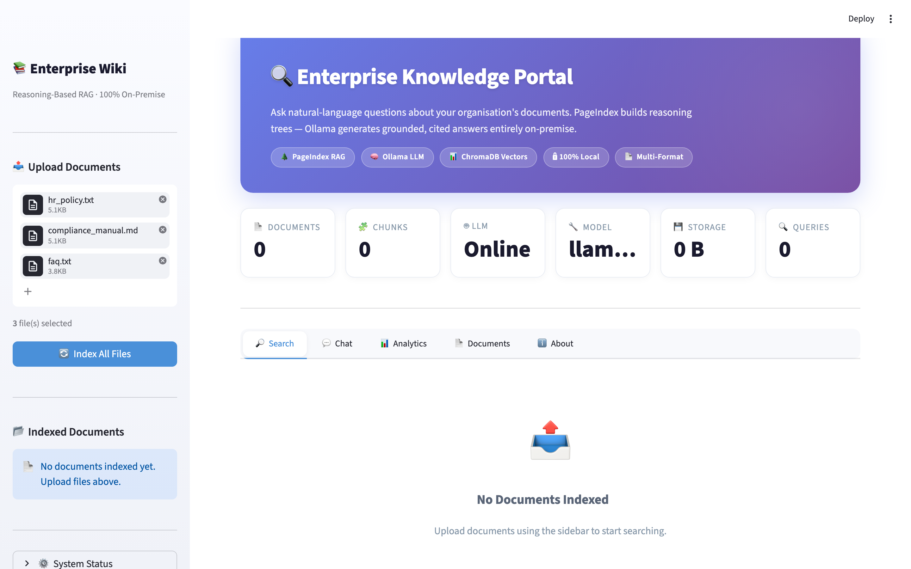

**Flow:**
1. Click "Browse files" or drag and drop into the upload area.
2. Selected files appear with their names and sizes.
3. Click **"Index All Files"** to begin the ingestion pipeline.

---

### 6.9 Step 2: Indexing in Progress

After clicking "Index All Files", the system processes each file through the pipeline: parse, chunk, embed, store. A progress indicator shows the current status.

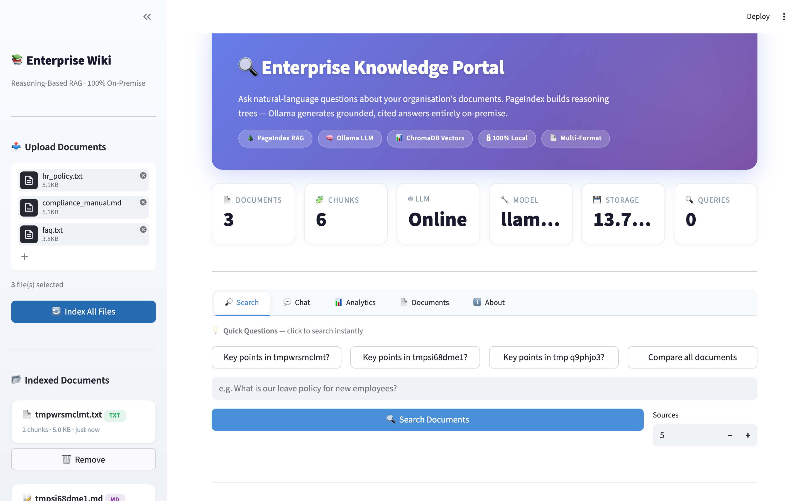

**What happens behind the scenes:**
1. The file is parsed and split into overlapping text chunks (default: 512 tokens, 64-token overlap).
2. Each chunk is embedded using `nomic-embed-text` via Ollama.
3. Embeddings and text are stored in ChromaDB.
4. PageIndex builds a reasoning tree for the document (when available).

---

### 6.10 Step 3: Indexing Complete

Once indexing finishes, a success notification appears and the indexed documents appear in the sidebar's "Indexed Documents" section.


---

### 6.11 Search Tab — With Indexed Documents

After indexing, the Search tab becomes fully functional. It shows:

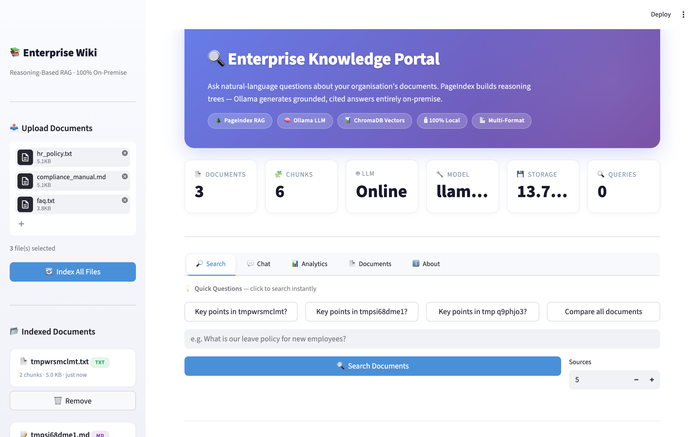

**Components:**
- **Smart Suggestions** — auto-generated question pills based on indexed document names (e.g., "Key points in hr_policy?"). Click any pill to instantly run that query.
- **Search input** — type natural-language questions.
- **Search / Sources buttons** — trigger the query and control source display.
- **Answer panel** — LLM-generated answer grounded in retrieved chunks with response time, source count, and chunks searched.
- **Source cards** — each source shows the originating file, chunk number, relevance percentage bar, and a text preview.
- **Export buttons** — save the answer as Markdown or a professional PDF report.

---

### 6.12 Analytics Tab — Charts, Metrics & Insights

The Analytics dashboard provides visual insights into the indexed knowledge base.

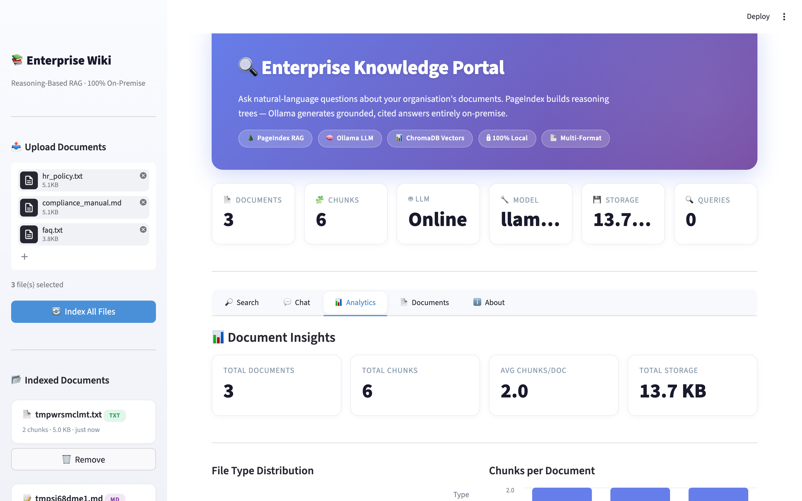

**Dashboard components:**
- **Summary metrics** — Total Documents, Total Chunks, Average Chunks/Document, Total Storage.
- **File Type Distribution** — Altair donut chart showing the breakdown by file type (TXT, MD, PDF, DOCX).
- **Chunks per Document** — Altair bar chart showing how many chunks each document produced.
- **Document Sizes** — bar chart comparing file sizes across all indexed documents.
- **Session Query Log** — table of all queries made in the current session with response times and source counts.

---

### 6.13 Document Explorer — Browse & Inspect

The Document Explorer lets users browse all indexed documents, view metadata, and inspect individual chunks.

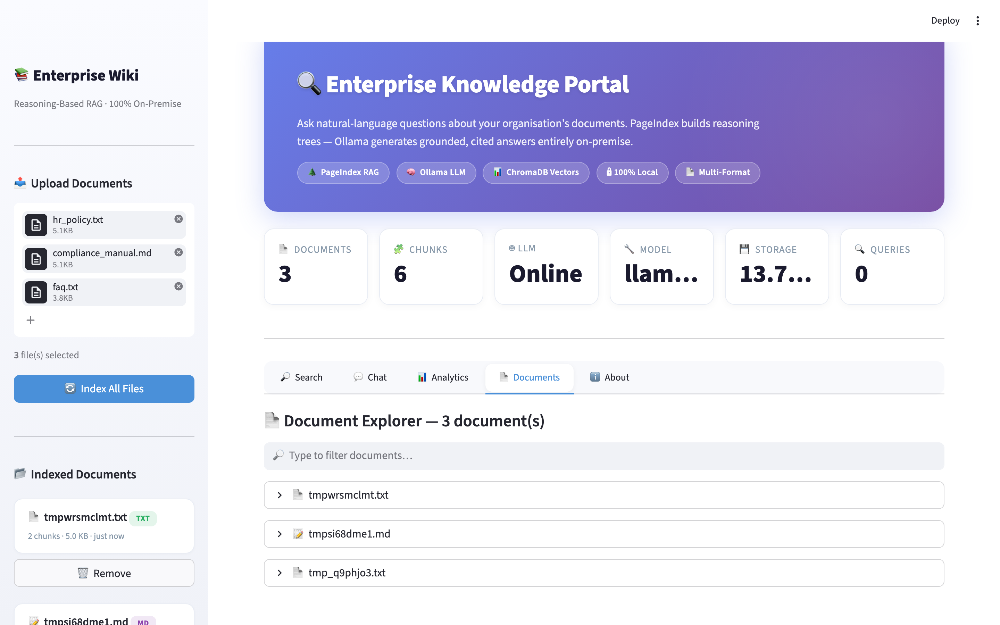

**Features:**
- **Filter bar** — type to filter documents by name.
- **Document list** — collapsible entries for each indexed document with file type icon and name.
- **Metadata** — file size, chunk count, indexing timestamp, file type, content hash, and document ID.

---

### 6.14 Document Expanded — Chunk-Level Inspection

Click on any document in the explorer to expand it and view its individual chunks.

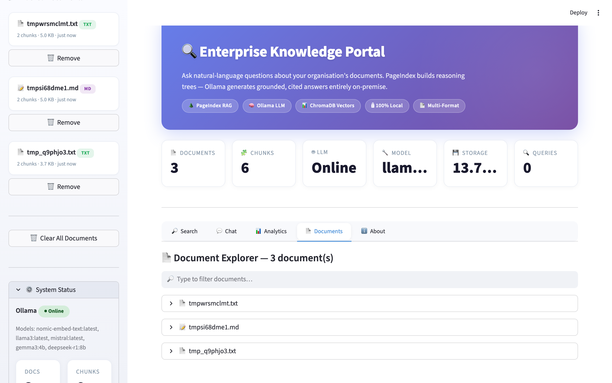

**Details shown:**
- **Chunk content preview** — full text of each chunk with chunk index numbers.
- **Chunk navigation** — shows how many chunks are displayed vs total (e.g., "Showing 8 of 22 chunks").
- **Delete button** — remove a specific document and all its chunks from the knowledge base.

---

### 6.15 About Tab — With Active Data

The About tab also reflects live system data, showing current configuration values and document statistics alongside the architectural diagrams.

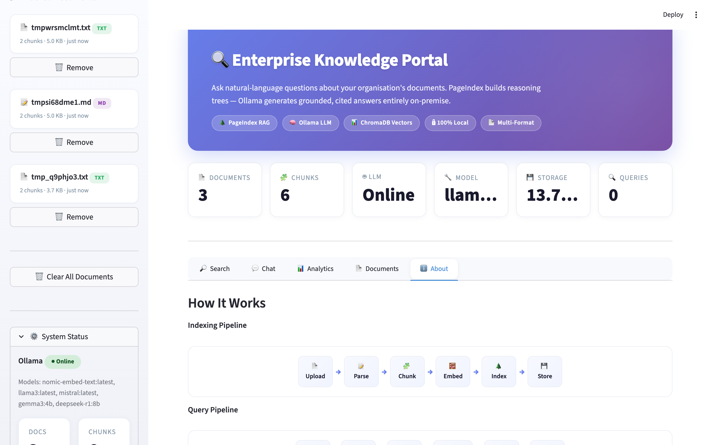

---

### 6.16 Sidebar — With Indexed Documents & System Status

After indexing, the sidebar populates with all indexed documents, showing type badges, chunk counts, sizes, and timestamps. The System Status panel shows live Ollama connection, available models, and storage metrics.

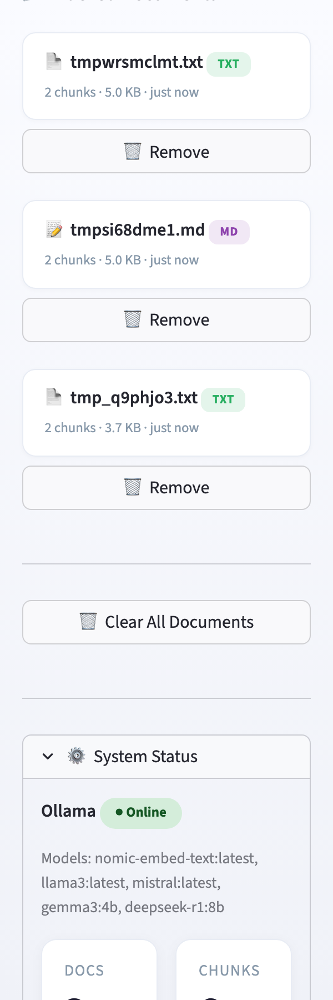

**Sidebar state after indexing:**
- Each document card shows: file name, type badge (TXT/MD), chunk count, file size, and "just now" timestamp.
- "Remove" button per document for individual deletion.
- "Clear All Documents" button for bulk reset.
- System Status: Ollama online, available models listed, docs/chunks/storage metrics.

---

## 7. Step-by-Step Execution Guide

> Complete walkthrough from zero to a working portal with answers.

### Step 1: Clone & Set Up Environment

**macOS / Linux:**
```bash
$ git clone https://github.com/maneeshkumar52/pageindex-enterprise-wiki.git
$ cd pageindex-enterprise-wiki

$ python3 -m venv .venv
$ source .venv/bin/activate

$ pip install --upgrade pip
$ pip install -r requirements.txt
```

**Windows (PowerShell):**
```powershell
> git clone https://github.com/maneeshkumar52/pageindex-enterprise-wiki.git
> cd pageindex-enterprise-wiki

> python -m venv .venv
> .venv\Scripts\Activate.ps1

> python -m pip install --upgrade pip
> pip install -r requirements.txt
```

**Expected output:**
```
Successfully installed chromadb-0.6.3 streamlit-1.56.0 pageindex-0.2.8 ...
```

### Step 2: Install & Start Ollama

**macOS:**
```bash
# Install via Homebrew or install script
$ brew install ollama
# or: curl -fsSL https://ollama.com/install.sh | sh
```

**Windows:** Download and run the installer from [ollama.com/download](https://ollama.com/download).

**Both platforms:**
```bash
# Pull required models
$ ollama pull llama3
$ ollama pull nomic-embed-text

# Start the Ollama server (keep this terminal open)
$ ollama serve
```

**Expected output:**
```
Listening on 127.0.0.1:11434
```

### Step 3: Verify Ollama is Running

```bash
# In a new terminal:
$ curl http://localhost:11434/api/tags | python3 -m json.tool
```

**Expected output:**
```json
{
  "models": [
    { "name": "llama3:latest", "size": 4661211808 },
    { "name": "nomic-embed-text:latest", "size": 274302450 }
  ]
}
```

### Step 4: Run the Test Suite

```bash
$ source .venv/bin/activate
$ python -m pytest tests/ -v
```

**Expected output:**
```
tests/test_utils.py::TestLoadConfig::test_loads_yaml                        PASSED
tests/test_utils.py::TestLoadConfig::test_missing_file_raises               PASSED
tests/test_utils.py::TestChunkText::test_basic_chunking                     PASSED
tests/test_utils.py::TestChunkText::test_overlap                            PASSED
tests/test_utils.py::TestFileHash::test_hash_consistency                    PASSED
tests/test_utils.py::TestExport::test_export_creates_file                   PASSED
tests/test_ollama_client.py::TestOllamaAvailability::test_is_available_true PASSED
tests/test_ollama_client.py::TestOllamaAvailability::test_is_available_false PASSED
tests/test_ollama_client.py::TestOllamaChat::test_chat_returns_content      PASSED
tests/test_ollama_client.py::TestOllamaEmbed::test_embed_returns_vector     PASSED
tests/test_indexing_pipeline.py::TestVectorStore::test_add_and_search       PASSED
tests/test_indexing_pipeline.py::TestPageIndexPipeline::test_ingest_file    PASSED
... (22 more tests)
======================== 34 passed in 1.4s ========================
```

### Step 5: Launch the Portal

```bash
$ streamlit run app.py
```

**Expected output:**
```
  You can now view your Streamlit app in your browser.

  Local URL: http://localhost:8501
  Network URL: http://192.168.x.x:8501
```

### Step 6: Upload Sample Documents

1. Open **http://localhost:8501** in your browser
2. In the sidebar, expand **📤 Upload Documents**
3. Drag the three sample files from `sample_docs/`:
   - `hr_policy.txt` — HR leave & benefits policy
   - `compliance_manual.md` — Regulatory compliance guide
   - `faq.txt` — Employee frequently asked questions
4. Click **🔄 Index All Files**
5. Watch: progress bar fills → toast notifications per file → metrics update

**Behind the scenes:**
```
[INFO] Ingesting: hr_policy.txt
[INFO] → SHA-256: a3f7c2… (dedup check passed)
[INFO] → Converted to Markdown → data/workspace/hr_policy.md
[INFO] → PageIndex tree built (reasoning hierarchy)
[INFO] → 15 chunks embedded into ChromaDB
[INFO] → Registered in doc_registry.json

[INFO] Ingesting: compliance_manual.md
[INFO] → 22 chunks embedded into ChromaDB

[INFO] Ingesting: faq.txt
[INFO] → 10 chunks embedded into ChromaDB
```

### Step 7: Search — Ask Your First Question

1. Switch to the **🔎 Search** tab
2. **Option A**: Click a suggested question like "Key points in hr policy?"
3. **Option B**: Type your own: `What is the leave policy for new employees?`
4. Adjust the **Sources** slider (1–10) for more or fewer results
5. Click **🔍 Search Documents**
6. View: answer → export buttons (MD + PDF) → source cards with relevance bars
7. Click **📄 Export PDF** to save a professional report

### Step 8: Chat — Multi-Turn Conversation

1. Switch to the **💬 Chat** tab
2. Ask: `What are the compliance requirements for data handling?`
3. Follow up: `What happens if someone violates these policies?`
4. Expand **📌 source(s)** in each response to see cited chunks
5. Click **🧹 Clear Conversation** to reset

### Step 9: Analytics — Explore Document Insights

1. Switch to the **📊 Analytics** tab
2. View summary metrics: total documents, chunks, average, storage
3. Examine the **donut chart** for file type distribution
4. Review **bar charts** for chunks per document and document sizes
5. Scroll down to the **Session Query Log** table

### Step 10: Document Explorer — Inspect Chunks

1. Switch to the **📄 Documents** tab
2. Use the filter box to search by filename
3. Expand any document to see:
   - Metadata: size, chunks, indexed time, hash, ID
   - Content preview: first 8 chunks with actual text
4. Click **🗑️ Delete** to remove individual documents

### Step 11: Verify Exports

```bash
$ ls outputs/
20240115_143025_what_is_the_leave_policy.md
20240115_143025_what_is_the_leave_policy.pdf

$ cat outputs/*.md
# Query Result — 2024-01-15 14:30:25 UTC

## Question
What is the leave policy for new employees?

## Answer
New employees are entitled to 15 days of annual leave...

## Sources
**1.** hr_policy.txt — page N/A
> Annual leave entitlement for full-time employees is 15 working…
```

---

## 8. Project Structure

```
pageindex-enterprise-wiki/
│
├── app.py                    # Streamlit UI — 5 tabs, sidebar, 6-metric dashboard
├── indexing_pipeline.py      # PageIndex tree + ChromaDB vector pipeline
├── ollama_client.py          # Ollama REST API wrapper (chat, embed, stream)
├── utils.py                  # Config, logging, parsing, chunking, export (MD + PDF)
├── config.yaml               # All runtime configuration (single source of truth)
│
├── requirements.txt          # Pinned Python dependencies
├── Dockerfile                # Multi-stage production container
├── docker-compose.yml        # Full stack: Ollama + Wiki app
├── .dockerignore
├── .gitignore
│
├── .streamlit/
│   └── config.toml           # Streamlit theme customisation
│
├── sample_docs/              # Example enterprise documents
│   ├── hr_policy.txt         # HR policy manual
│   ├── compliance_manual.md  # Compliance & regulatory guide
│   └── faq.txt               # Employee FAQ
│
├── outputs/                  # Exported results (Markdown + PDF)
│   └── .gitkeep
│
├── tests/                    # Pytest test suite (34 tests)
│   ├── __init__.py
│   ├── test_utils.py
│   ├── test_ollama_client.py
│   └── test_indexing_pipeline.py
│
└── data/                     # Runtime data (gitignored)
    ├── uploads/              # Raw uploaded files
    ├── indexes/              # Document registry JSON
    ├── workspace/            # PageIndex tree structures
    └── chromadb/             # ChromaDB persistence
```

### Module Responsibilities

| Module | Lines | Responsibility | Key Classes/Functions |
|--------|-------|---------------|----------------------|
| `app.py` | ~680 | 5-tab UI, sidebar, session state, file upload | `main()`, `_render_sidebar()`, `_render_main()` |
| `indexing_pipeline.py` | ~390 | Ingestion, retrieval, chunk inspection | `PageIndexPipeline`, `VectorStore` |
| `ollama_client.py` | ~140 | LLM communication (chat, embed, stream) | `OllamaClient` |
| `utils.py` | ~370 | Config, parsing, chunking, export (MD + PDF) | `load_config()`, `extract_text()`, `export_to_pdf()` |
| `config.yaml` | ~50 | Centralised configuration | — |

---

## 9. Configuration

All settings live in `config.yaml`. **No hardcoded paths or model names exist in the codebase.**

```yaml
# LLM / Ollama
ollama:
  base_url: "http://localhost:11434"
  model: "llama3"                      # Q&A generation model
  embedding_model: "nomic-embed-text"  # Vector embedding model
  temperature: 0.3                     # Lower = more deterministic
  timeout: 120                         # Request timeout (seconds)

# PageIndex (self-hosted)
pageindex:
  workspace: "data/workspace"
  index_model: "ollama/llama3"         # LiteLLM model string
  retrieve_model: "ollama/llama3"

# ChromaDB
chromadb:
  persist_directory: "data/chromadb"
  collection_name: "wiki_documents"
  chunk_size: 512                      # Words per chunk
  chunk_overlap: 64                    # Overlap between chunks

# Storage
storage:
  upload_dir: "data/uploads"
  index_dir: "data/indexes"
  output_dir: "outputs"
```

### Environment Variables

| Variable | Purpose | Default |
|----------|---------|---------|
| `OLLAMA_HOST` | Override Ollama URL (Docker) | `http://localhost:11434` |
| `OLLAMA_API_BASE` | Used by PageIndex/LiteLLM | `http://localhost:11434` |

---

## 10. Usage Guide

### 10.1 Upload Documents

1. Open the sidebar → **📤 Upload Documents**
2. Drag-and-drop or click to select PDF, DOCX, TXT, or Markdown files
3. Click **🔄 Index All Files**
4. Progress bar tracks each file. Toast notifications confirm success
5. Metrics update in real-time (document count, chunks, storage)

### 10.2 Search with Smart Suggestions

1. Switch to the **🔎 Search** tab
2. Click a **Quick Question** button (auto-generated from document names)
3. Or type your own natural-language question
4. Adjust the **Sources** slider (1–10) for result depth
5. Click **🔍 Search Documents**
6. View the answer, source cards with relevance bars, and export options

### 10.3 Conversational Chat

1. Switch to the **💬 Chat** tab
2. Type a question in the chat input
3. Each response shows expandable source references
4. Ask follow-up questions — context is maintained across turns
5. Click **🧹 Clear Conversation** to reset

### 10.4 Analytics Dashboard

1. Switch to the **📊 Analytics** tab
2. Review 4 summary metrics at the top
3. Interactive charts: file type donut, chunks bar, sizes bar
4. Session query log shows all queries with timing

### 10.5 Document Explorer

1. Switch to the **📄 Documents** tab
2. Filter by filename using the search box
3. Expand any document to see metadata and chunk preview
4. Delete individual documents or use **🗑️ Clear All** in the sidebar

### 10.6 Export Results

- **Markdown**: Click **📥 Export Markdown** after a search
- **PDF**: Click **📄 Export PDF** for a professional report
- Files saved to `outputs/` with timestamps

---

## 11. API Reference

### `OllamaClient`

```python
from ollama_client import OllamaClient

client = OllamaClient()
client.is_available()                         # → bool
client.list_models()                          # → ["llama3", "nomic-embed-text"]
client.chat(messages, model=None, system_prompt=None)  # → str
client.chat_stream(messages, ...)             # → Generator[str]
client.embed(text)                            # → list[float]
client.embed_batch(texts)                     # → list[list[float]]
client.ask_with_context(question, context)    # → str
```

### `PageIndexPipeline`

```python
from indexing_pipeline import PageIndexPipeline

pipeline = PageIndexPipeline()
metadata = pipeline.ingest("/path/to/doc.pdf")         # → dict
results  = pipeline.search("leave policy", n_results=5)  # → list[dict]
answer   = pipeline.ask("What is the leave policy?")     # → {"answer": str, "sources": [...]}
docs     = pipeline.list_documents()                      # → list[dict]
chunks   = pipeline.get_document_chunks(doc_id)           # → list[dict]
pipeline.delete_document(doc_id)                          # → bool
pipeline.document_count                                   # → int
pipeline.chunk_count                                      # → int
pipeline.storage_size                                     # → int (bytes)
```

### `VectorStore`

```python
from indexing_pipeline import VectorStore

store = VectorStore()
store.add_document(doc_id, text, metadata)  # → int (chunk count)
store.search(query, n_results=5)            # → list[dict]
store.delete_document(doc_id)
store.count                                 # → int
```

### Export Utilities

```python
from utils import export_to_markdown, export_to_pdf

# Markdown export
path = export_to_markdown(query, answer, sources, "outputs/")

# PDF export
path = export_to_pdf(query, answer, sources, "outputs/")
```

---

## 12. Docker Deployment

### Build & Run (Standalone)

```bash
docker build -t pageindex-wiki .

docker run -d \
  --name pageindex-wiki \
  -p 8501:8501 \
  -v $(pwd)/data:/app/data \
  -v $(pwd)/outputs:/app/outputs \
  -e OLLAMA_HOST=http://host.docker.internal:11434 \
  pageindex-wiki
```

### Docker Compose (Full Stack)

```bash
docker compose up -d

docker exec -it ollama ollama pull llama3
docker exec -it ollama ollama pull nomic-embed-text

docker compose logs -f wiki

docker compose down
```

### GPU Support (NVIDIA)

The `docker-compose.yml` includes GPU reservation for Ollama. Install the [NVIDIA Container Toolkit](https://docs.nvidia.com/datacenter/cloud-native/container-toolkit/install-guide.html). For CPU-only, remove the `deploy.resources` block.

---

## 13. Testing

### Run All Tests

```bash
pytest tests/ -v
pytest tests/ -v --cov=. --cov-report=term-missing
```

### Test Coverage

| File | Tests | Coverage |
|------|-------|----------|
| `test_utils.py` | 18 | Config, text extraction, chunking, hashing, metadata, export |
| `test_ollama_client.py` | 8 | Health checks, chat, streaming, embeddings, RAG |
| `test_indexing_pipeline.py` | 8 | VectorStore CRUD, registry, pipeline ingestion, dedup |

**Total: 34 tests** — all passing. External services mocked — runs offline without GPU.

---

## 14. Troubleshooting

| Problem | Solution |
|---------|----------|
| `Connection refused — localhost:11434` | Run `ollama serve` |
| `model "llama3" not found` | Run `ollama pull llama3` |
| `pageindex not installed` | Run `pip install pageindex` (portal works without it via ChromaDB fallback) |
| `Permission denied: data/chromadb` | `chmod -R 755 data/` |
| Large file upload timeout | Set `max_upload_mb: 500` in `config.yaml` and `maxUploadSize = 500` in `.streamlit/config.toml` |
| Docker: Ollama connection refused | Use `OLLAMA_HOST=http://ollama:11434` (compose) or `http://host.docker.internal:11434` (host) |

---

## 15. Production Checklist

### Security

- [ ] Run Ollama behind a firewall — do not expose port 11434
- [ ] Enable Streamlit authentication (reverse proxy or `streamlit-authenticator`)
- [ ] Use HTTPS via reverse proxy (Nginx, Caddy, Traefik)
- [ ] Restrict file permissions on `data/` directory
- [ ] Review `config.yaml` for production values

### Performance

- [ ] Use GPU-accelerated Ollama for production workloads
- [ ] Tune `chunk_size` and `chunk_overlap` for your document types
- [ ] Consider `mistral` or `phi3` for faster CPU inference
- [ ] Monitor ChromaDB at scale — consider sharding at 100k+ chunks

### Observability

- [ ] Review `data/app.log` for events
- [ ] Set `logging.level: DEBUG` for troubleshooting
- [ ] Monitor Ollama memory — large models need 8+ GB VRAM

### Scaling

- [ ] Deploy multiple Streamlit instances behind a load balancer
- [ ] Mount `data/` on shared storage (NFS, EFS) for multi-instance
- [ ] Run Ollama on a dedicated GPU server; update `base_url`

---

## 16. Contributing

1. Fork the repository
2. Create a feature branch (`git checkout -b feature/my-feature`)
3. Commit your changes (`git commit -m 'Add my feature'`)
4. Push to the branch (`git push origin feature/my-feature`)
5. Open a Pull Request

### Code Standards

- Python 3.11+ with type hints
- Format with `black`, lint with `ruff`
- All new features must include tests
- Config-driven — no hardcoded values

---

## 17. License

This project is licensed under the **MIT License**. See [LICENSE](LICENSE) for details.

---

<div align="center">

**Built by [Maneesh Kumar](https://github.com/maneeshkumar52)** — AI Architect

Powered by [PageIndex](https://github.com/VectifyAI/PageIndex) · [Ollama](https://ollama.com) · [Streamlit](https://streamlit.io) · [ChromaDB](https://www.trychroma.com/)

</div>
